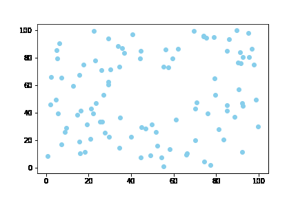
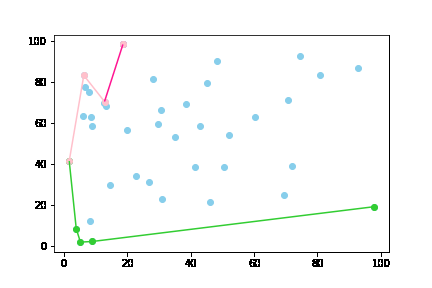
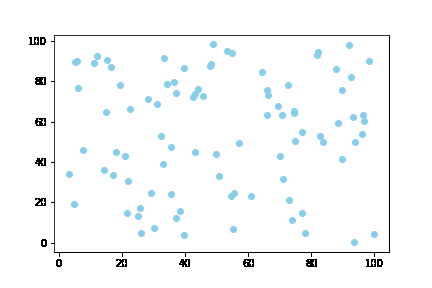

# **Convex hull**

### Three algorithms for finding convex hull of a finite set of points in two-dimensional space with step visualisation.    

#### **Quickhull:**
  

#### **Upper and lower:**
  

#### **Divide and conquer:**
  
